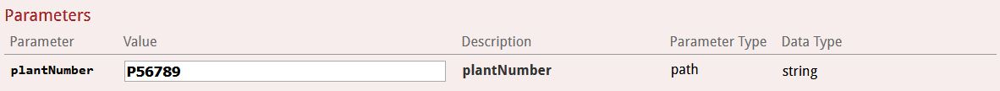

# Edge-service

**Inleiding:**  
Het thema dat ons is toegewezen is "tuincentra, werknemers en planten", we hebben hiervoor dus 3 Back-End microservices geschreven met één Edge-service die deze aanspreekt. Bijkomend hebben we gebruik gemaakt van Kubernetes Deployemt. De screenshots van het diagram staan ook hier weergegeven.

###GitHub Repositories Back-End services:
1. Employee service:
https://github.com/Goetsie/employee-service-APT
2. Garden Center service:
https://github.com/Goetsie/garden_center-service-APT
3. Plant service:
https://github.com/Goetsie/plant-service-APT

#####Deployment Diagram Microservices met Kubernetes: enkel Edge-service exposed

#####Deployment Diagram Microservices met Kubernetes testing: alle microservices exposed

-----------------------------------------------------------------------------------

####Bewijs output en werking swagger:
Alle calls:

1. /gardencenters (get)

2. /gardencenters/{gardencenterid}/employees (get)

3. /gardencenters/{gardencenterid}/plants (get)

4. /plants (get)

5. /plants (post)

6. /plants (put)

7. /plants/description/{description} (get)

8. /plants/name/{name} (get)

9. /plants/{plantNumber} (delete)

10. /plants/{plantNumber} (get)

###Code coverage edge service:

